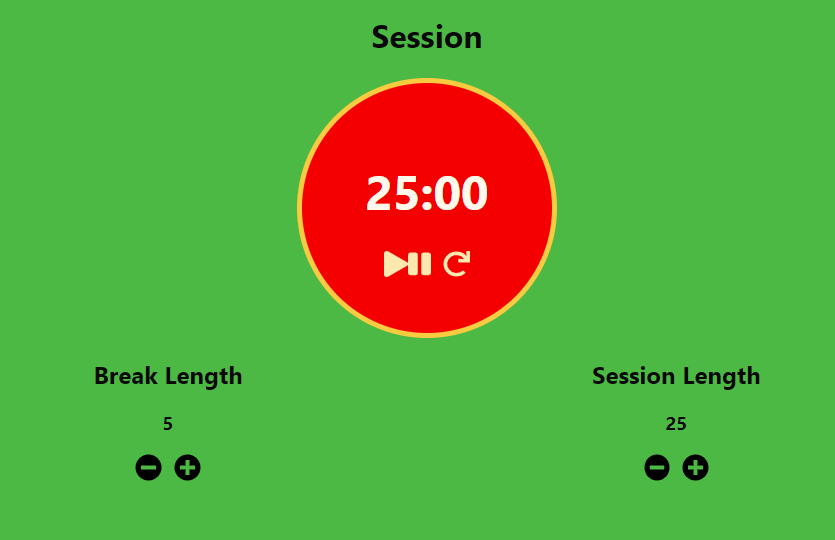

# Pomodoro Timer

My solution to [Build a 25 + 5 Clock](https://www.freecodecamp.org/learn/front-end-libraries/front-end-libraries-projects/build-a-25--5-clock) for the FCC:

This project was bootstrapped with [Create React App](https://github.com/facebook/create-react-app).

